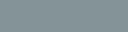
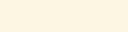
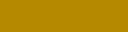
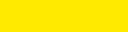
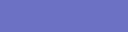
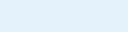
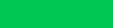

---
status:
author:
last-update:
---

:::{index} single: Design
:::
:::{index} single: Guidelines; Design
:::

(Design-Guidelines)=

# Design Guidelines

## Farben

Das Farbschema basiert auf dem [Solarized-Farbschema](https://ethanschoonover.com/solarized/) von Ethan Schoonover.
Es ist ein Farbkonzept für Texteditoren und Benutzeroberflächen und basiert auf einer bewusst reduzierten, harmonischen Farbpalette mit definierten Kontrastverhältnissen und unterstützt einen Hell- und Dunkelmodus (Light mode, Dark mode).

Eigenschaften
:   -   16 gezielt abgestimmte Farben
    -   Einheitliche Farblogik (Farben haben feste semantische Rollen)
    -   Gleiche Palette für Light- und Dark-Modus (nur invertiert genutzt)
    -   Fokus auf reduzierte Helligkeitskontraste statt reiner Schwarz-Weiß-Kontraste

Vorteile
:   -   Reduzierte Augenbelastung bei längerer Bildschirmarbeit
    -   Gute Lesbarkeit durch ausgewogene Kontrastverhältnisse
    -   Flexibler Wechsel zwischen Light- und Dark-Mode

Zusätzlich wurde die Farbpalette um Farben für spezielle Anwendungen ergänzt (*Ergänzungsfarben*).
Diese sollen nur unter bestimmten Umständen zum Einsatz kommen.

:::{list-table} Solarized-Farben (+ Ergänzungsfarben)
:header-rows: 1

*   -   Farbton
    -   Vorschau
    -   RGB (dezimal)
    -   HEX
    -   CMYK
    -   Anmerkungen

*   -   Base03
    -   
    -   0, 43, 54
    -   #002b36
    -   1.00, 0.21, 0.00, 0.79
    -   Hintergrund dunkel (Primär)

*   -   Base02
    -   
    -   7, 54, 66
    -   #073642
    -   0.91, 0.18, 0.00, 0.74
    -   Hintergrund dunkel (Kontrast)

*   -   Base01
    -   
    -   88, 110, 117
    -   #586e75
    -   0.25, 0.07, 0.00, 0.54
    -   Text auf hellem Hintergrund

*   -   Base00
    -   
    -   101, 123, 131
    -   #657b83
    -   0.23, 0.06, 0.00, 0.49
    -   Standardtext

*   -   Base0
    -   
    -   131, 148, 150
    -   #839496
    -   0.13, 0.03, 0.00, 0.41
    -   Sekundärer Text

*   -   Base1
    -   
    -   147, 161, 161
    -   #93a1a1
    -   0.09, 0.00, 0.00, 0.37
    -   Text auf dunklem Hintergrund

*   -   Base2
    -   
    -   238, 232, 213
    -   #eee8d5
    -   0.00, 0.03, 0.10, 0.07
    -   Hintergrund hell (Kontrast)

*   -   Base3
    -   
    -   253, 246, 227
    -   #fdf6e3
    -   0.00, 0.03, 0.10, 0.01
    -   Hintergrund hell (Primär)

*   -   Yellow
    -   
    -   181, 137, 0
    -   #b58900
    -   0.00, 0.25, 1.00, 0.29
    -   Gedämpftes Gelb

*   -   Yellow-Bright
    -   
    -   255, 234, 0
    -   #ffea00
    -   0.00, 0.08, 1.00, 0.00
    -   *Ergänzung.* Highlight

*   -   Yellow-Custom
    -   
    -   241, 196, 15
    -   #f1c40f
    -   0.00, 0.18, 0.94, 0.06
    -   *Ergänzung.* Kräftige Zwischenstufe

*   -   Orange
    -   
    -   203, 75, 22
    -   #cb4b16
    -   0.00, 0.63, 0.89, 0.20
    -   Warnfarbe

*   -   Red
    -   
    -   220, 50, 47
    -   #dc322f
    -   0.00, 0.77, 0.79, 0.14
    -   Alarm

*   -   Custom-1
    -   
    -   148, 38, 0
    -   #942600
    -   0.00, 0.75, 1.00, 0.42
    -   *Ergänzung.* Dunkler Rotton

*   -   Magenta
    -   
    -   211, 54, 130
    -   #d33682
    -   0.00, 0.74, 0.38, 0.17
    -   Akzent

*   -   Violet
    -   
    -   108, 113, 196
    -   #6c71c4
    -   0.45, 0.42, 0.00, 0.23
    -   Sekundärakzent

*   -   Blue
    -   
    -   38, 139, 210
    -   #268bd2
    -   0.82, 0.34, 0.00, 0.18
    -   Primärfarbe

*   -   Blue-Light
    -   
    -   227, 242, 251
    -   #e3f2fb
    -   0.10, 0.04, 0.00, 0.02
    -   Heller Hintergrund

*   -   Cyan
    -   
    -   42, 161, 152
    -   #2aa198
    -   0.74, 0.00, 0.06, 0.37
    -   Info

*   -   Green
    -   
    -   133, 153, 0
    -   #859900
    -   0.13, 0.00, 1.00, 0.40
    -   Status (gedämpft)

*   -   Green-Bright
    -   
    -   0, 200, 83
    -   #00c853
    -   1.00, 0.00, 0.58, 0.22
    -   *Ergänzung.* Aktiver Status
:::